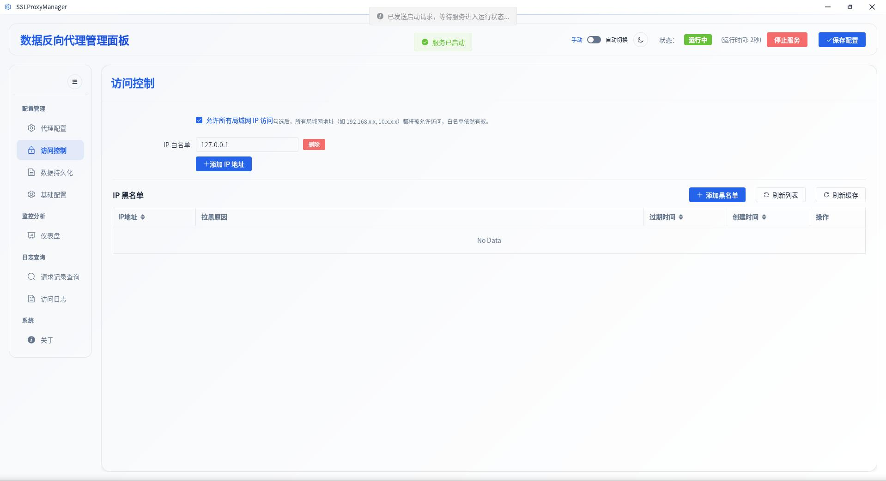
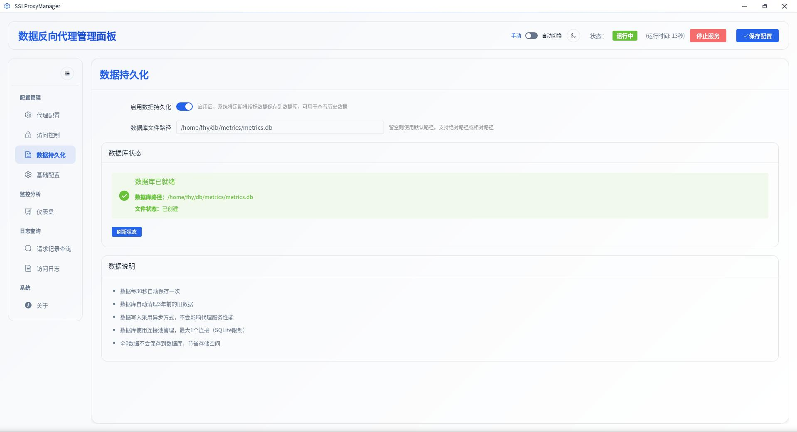
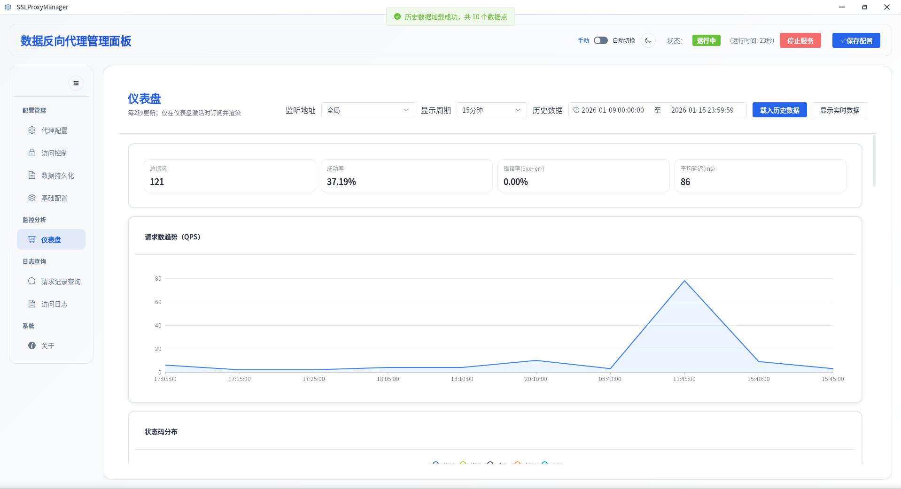
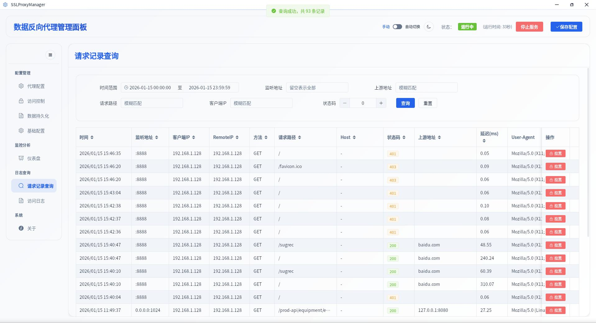

# SSLProxyManager

**[中文文档 (Chinese Documentation)](README_zh.md)**

SSLProxyManager is a desktop proxy management tool based on **Tauri 2 + Rust**, providing a management interface (frontend: **Vue 3 + Vite + Element Plus**) for configuring and managing:

- HTTP/HTTPS reverse proxy
- WebSocket (WS/WSS) reverse proxy
- Stream (TCP/UDP) Layer 4 proxy
- Static resource hosting
- Access control (LAN/whitelist)
- Runtime status and log viewing

## Features Overview

- **HTTP/HTTPS Proxy (rules/routes)**
  - Multiple listen nodes (`listen_addr`)
  - TLS (certificate/private key)
  - Basic Auth
  - Routing (path prefix matching)
  - Upstream list (with weights)
  - `proxy_pass_path` path rewriting
  - Static directory priority (`static_dir`)
  - Header injection (`set_headers`)

- **WebSocket Proxy (ws_proxy)**
  - Each WS rule can be independently enabled
  - **New: WS global switch `ws_proxy_enabled`** (when globally disabled, WS listeners will not start)

- **Stream Proxy (TCP/UDP, stream)**
  - `listen_port` listen port (TCP or UDP)
  - `proxy_pass` binds to upstream name
  - Upstream supports consistent selection by client IP (default `hash_key = "$remote_addr"`)
  - `proxy_connect_timeout` / `proxy_timeout` (string format, e.g., `300s`)

## Tech Stack

- Backend: Rust (Tauri 2)
- Frontend: Vue 3, Vite, Element Plus

## Screenshots










## Directory Structure

- `src/`: Rust backend code
- `frontend/`: Frontend project (Vite)
- `tauri.conf.json`: Tauri configuration (dev/build commands, devUrl, frontendDist, etc.)
- `config.toml`: Runtime configuration (can be placed in project root in development mode)
- `config.toml.example`: Configuration example

## Requirements

- Node.js + npm
- Rust toolchain (stable)

## Local Development

### 1) Install Frontend Dependencies

```bash
cd frontend
npm install
```

### 2) Start Tauri Development Mode

Execute in the project root directory:

```bash
npm run tauri:dev
```

This command will, according to `tauri.conf.json`:

- First enter `frontend` and execute `npm run dev`
- Then start Tauri and load `http://localhost:5173`

## Build & Release

Execute in the project root directory:

```bash
npm run tauri:build
```

This command will:

- First enter `frontend` and execute `npm run build` (output: `frontend/dist`)
- Then package with Tauri

## Configuration (config.toml)

The project uses TOML for configuration.

- **Development mode** (debug): If `config.toml` exists in the project root, it will be read with priority.
- **Linux production mode**: Default location `~/.config/SSLProxyManager/config.toml`

> It is recommended to refer directly to `config.toml.example`.

### 1) HTTP/HTTPS Proxy (rules)

- `[[rules]]`: Listen node
  - `listen_addr`: Listen address, e.g., `:8888` or `0.0.0.0:1024`
  - `ssl_enable`: Whether to enable TLS
  - `cert_file` / `key_file`: Certificate and private key paths
  - `basic_auth_enable` / `basic_auth_username` / `basic_auth_password`
- `[[rules.routes]]`: Route
  - `path`: Path prefix matching
  - `static_dir`: Static directory (optional)
  - `proxy_pass_path`: Forward path rewriting (optional)
  - `exclude_basic_auth`: Whether this route skips Basic Auth (optional)
  - `follow_redirects`: Whether the proxy follows upstream 30x redirects (optional)
  - `[rules.routes.set_headers]`: Header injection (optional)
  - `[[rules.routes.upstreams]]`: Upstream list (optional)

### 2) WS Proxy (ws_proxy)

- **`ws_proxy_enabled`**: WS global switch (default `true`)
  - `false`: WS listeners will not start (even if a ws rule has enabled=true)
  - `true`: Then each ws rule's `enabled` takes effect

- `[[ws_proxy]]`: WS listen rule list
  - `enabled`: Whether to enable this rule
  - `listen_addr`: Listen address, e.g., `0.0.0.0:8800`
  - `ssl_enable`: Whether to enable TLS (wss)
  - `cert_file` / `key_file`: Certificate and private key paths
  - `[[ws_proxy.routes]]`
    - `path`: Path prefix
    - `upstream_url`: Upstream WS address, e.g., `ws://127.0.0.1:9000`

### 3) Stream (TCP/UDP) Proxy (stream)

Stream is used for Layer 4 proxy: listen on a TCP/UDP port and forward to upstream.

- `[stream]`
  - `enabled`: Global switch
  - `[[stream.upstreams]]`
    - `name`: Upstream name (referenced by `proxy_pass`)
    - `hash_key`: Default `$remote_addr` (consistently select upstream by client IP)
    - `consistent`: Currently reserved as a configuration item
    - `[[stream.upstreams.servers]]`
      - `addr`: `host:port`
      - `weight` / `max_fails` / `fail_timeout`: Fields reserved (can be enhanced in future strategies)
  - `[[stream.servers]]`
    - `enabled`: Whether to enable
    - `listen_port`: Listen port
    - `udp`: `false`=TCP, `true`=UDP
    - `proxy_pass`: Reference upstream's `name`
    - `proxy_connect_timeout`: e.g., `300s`
    - `proxy_timeout`: e.g., `600s`

#### Nginx Example Comparison

You can use the following Nginx stream configuration to understand the correspondence:

```nginx
stream {
    upstream sendimage {
        hash $remote_addr consistent;
        server 59.xx.xx.xx:8089 max_fails=1 fail_timeout=30s;
    }

    server {
        listen 50002;
        proxy_pass sendimage;
        proxy_connect_timeout 300s;
        proxy_timeout 600s;
    }
}
```

The equivalent configuration in this project can be found in the `[stream]` section of `config.toml.example`.

## FAQ

- The frontend development server port defaults to `5173` (see `devUrl` in `tauri.conf.json`).
- If you need to change the frontend dev/build commands, please modify `build.beforeDevCommand` / `build.beforeBuildCommand` in the root directory's `tauri.conf.json`.

## Disclaimer

This project is for learning and legal, compliant network proxy/reverse proxy configuration management scenarios only. Use of this software may involve network access control, certificate management, traffic forwarding, and other operations, with potential risks including but not limited to data leakage, service interruption, configuration errors leading to security risks, etc. You are responsible for evaluating and assuming all risks and responsibilities when using this project.

- **Legal Compliance**: Please ensure your use complies with local laws and regulations and relevant network service terms. It is prohibited to use this project for any unauthorized penetration, attacks, bypassing access controls, data theft, spreading malware, infringing on others' privacy, or any other illegal or unauthorized purposes. Any legal liability, administrative penalties, third-party claims, and related consequences arising from your use of this project for illegal, non-compliant, or unauthorized activities shall be borne by you, and the authors and contributors assume no responsibility.
- **No Warranty**: This project is provided "as is" without any express or implied warranty (including but not limited to fitness, reliability, accuracy, availability, error-free/defect-free, etc.).
- **Limitation of Liability**: The authors and contributors assume no responsibility for any direct or indirect losses (including but not limited to profit loss, data loss, business interruption, equipment or system damage, etc.) caused by the use or inability to use this project.

If you do not agree to the above terms, please do not use, distribute, or develop based on this project.
